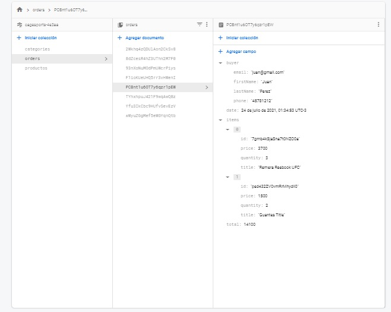

# REACT Ecommerce CageSport
Proyecto realizado para CoderHouse con React y JavaScript.
- Idea: ecommerce de una tienda de venta de artículos deportivos orientados a las artes marciales mixtas.
## User brief
- Un usuario debe poder ingresar, navegar por los productos e ir a sus detalles.
- Desde el detalle se debe poder ver la descripción, foto y precio e ingresarlo al carrito. 
- Una vez que el carrito tenga al menos un producto, se deberá visualizar un listado compacto de la orden con el precio total. 
- Al ingresar su nombre, apellido, teléfono e e-mail (ingresándolo dos veces para corroborar que sea correcto), debe activarse el botón de ‘realizar compra’.
- Al clickear ‘realizar compra’ debe guardarse en la base de datos una orden que tenga todos los productos, la fecha y dar feedback del número de orden.

## Dependencias
- [Material-UI](https://material-ui.com/)
- [Material-Icons](https://material-ui.com/es/components/material-icons/)
- [React Router Dom](https://reactrouter.com/web/guides/quick-start)

## Página funcional de muestra
[CAGE SPORTS](https://cage-sports.vercel.app/) - Vercel

## Navegacion y Compra

## React info / Available Scripts
En el directorio del proyecto ejecutá:
### `npm install`

Instala las dependencias necesarias para ejecutar el proyecto.

### `npm start`

Ejecuta la aplicación en el modo de desarrollador.
Abre [http://localhost:3000](http://localhost:3000) para verla en el navegador.

# Emiliano Medina - CoderHouse
